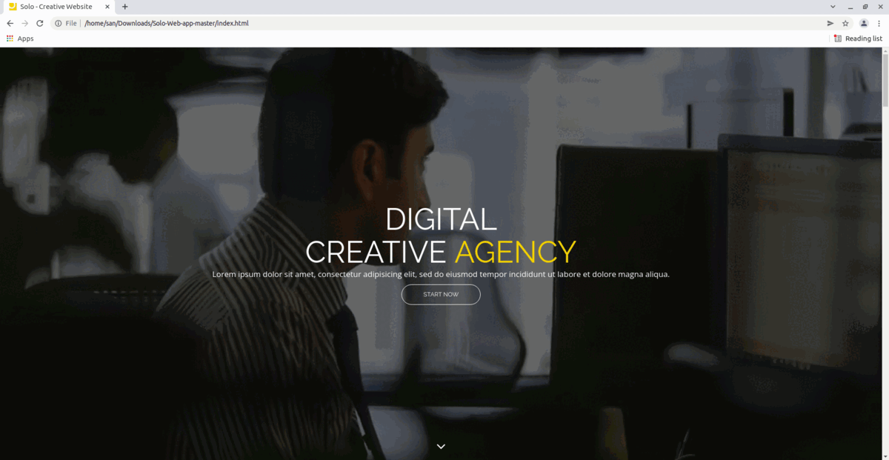
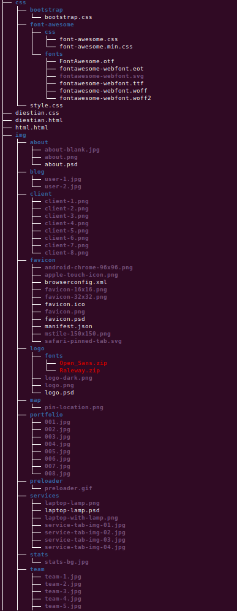

# Solo Web app

This is solo app 

**Table of Contents**
- [Overview][overview]
- [Structure][structure]
- [Features][features]
- [Bugs][bugs]
- [Todo][todo]
- [Credits][credits]
- [Furthure Works][furthure-works]
- [Conclusion][conclusion]

# Overview
The ui flow gif is as follows

# Structure

# Features
1. **About**
2. **Blog**
3. **Client**
4. **Portfolio**
5. **Services**
6. **Team**

# Bugs

# Todo
Losts of works are reming todo.

# Credits
This is the copy cat project from udemay 

# Furthure Works

# Conclusion

[overview]:<#overview>
[structure]:<#structure>
[features]:<#features>
[bugs]:<#bugs>
[credits]:<#credits>
[furthure-works]:<#furthure-works>
[conclusion]:<#conclusion>
[todo]:<#todo>

